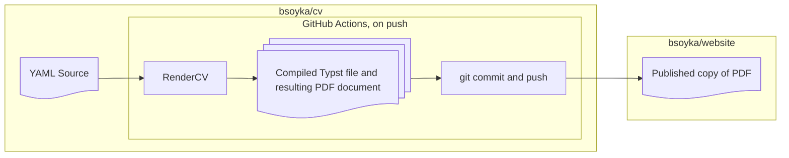

# My curriculum vitae

This repository holds the source for my curriculum vitae (CV) document. You can
see the live version at [bsoyka.me/cv.pdf](https://bsoyka.me/cv.pdf).

I intend for this to be a very living and comprehensive document, with frequent
updates to reflect what I'm up to in the world. It is not a trimmed, one-page
resume, but rather a broader list of the things I've spent my time on.

## How it works
Every time I push changes to this repo, the following occurs automatically
through GitHub Actions:
1. [RenderCV](https://docs.rendercv.com/) compiles
   [the source YAML file](Ben_Soyka_CV.yaml) to a PDF.
2. The new PDF is pushed to
   [my website repository](https://gh.bsoyka.,e/website).
3. Cloudflare rebuilds my website and deploys the new CV document worldwide.

All of this happens within about a minute, enabling me to quickly publish
changes to this document with minimal effort.

## Tooling reference

The only prerequisite for working on this project is
[mise-en-place](https://mise.jdx.dev/). mise will automatically use
[uv](https://docs.astral.sh/uv/) to install Python 3.14, RenderCV, and any other
dependencies, creating a virtual environment for the project.

To build the CV document, run `mise build`. This will output a
[Typst](https://typst.app/) source document and its resulting PDF file, both
within a directory called `rendercv_output/`.

To watch the source file for changes and continuously build the output, run
`mise build --watch`.
